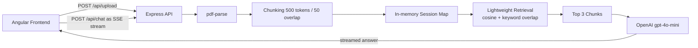

# DocChat

**AI-powered document Q&A with RAG architecture**

[](#live-demo)
[](#)
[](https://angular.dev/)
[](https://expressjs.com/)
[](https://platform.openai.com/)
[](https://tailwindcss.com/)

DocChat is a production-style AI document assistant built as a split frontend/backend system. Users upload a PDF, the backend extracts and chunks its contents, a lightweight retrieval layer selects the most relevant passages, and OpenAI streams a grounded answer back to the UI in real time.

## Screenshot Placeholder

Add product screenshots here once deployed:

- `docs/hero-dashboard.png`
- `docs/upload-state.png`
- `docs/streaming-chat.png`

## Features

- Angular 18 frontend with standalone components, OnPush change detection, and a dark SaaS UI
- Node.js + Express backend with PDF ingestion, in-memory sessions, and SSE streaming
- Retrieval-Augmented Generation flow using chunking plus cosine/keyword scoring
- Source chunk disclosure below each AI response for grounded answers
- Drag-and-drop PDF upload with progress state, inline validation, and frontend PDF preview
- Suggested starter questions generated from document content
- Session cleanup endpoint for removing uploaded documents from memory
- Rate limiting, CORS configuration, and deployment config for Render + Vercel
- Mobile-responsive layout tuned for 375px, 768px, and desktop breakpoints

## Architecture



## Project Structure

```text
/
├── frontend/   Angular 18 + Angular Material + TailwindCSS
└── backend/    Express API + OpenAI streaming + PDF ingestion
```

## How It Works

1. A PDF is uploaded to the backend with `multer`.
2. `pdf-parse` extracts raw text from the document.
3. The backend splits the text into overlapping chunks to preserve context across boundaries.
4. For each user question, the backend scores chunks with cosine similarity plus keyword overlap.
5. The top 3 chunks are injected into a constrained system prompt.
6. OpenAI streams the answer back to the Angular client over Server-Sent Events.
7. The UI renders tokens live and exposes the exact chunks used for the answer.

This is a simple RAG setup by design: enough retrieval grounding to feel realistic in an interview or portfolio review, without introducing a database or vector store just to prove the pattern.

## Local Setup

### 1. Install dependencies

```bash
npm run install:all
```

### 2. Configure environment variables

```powershell
Copy-Item backend/.env.example backend/.env
```

```bash
cp backend/.env.example backend/.env
```

Set:

- `OPENAI_API_KEY`
- `PORT`
- `MAX_FILE_SIZE`
- `ALLOWED_ORIGINS`

### 3. Start the backend

```bash
npm run dev:backend
```

### 4. Start the frontend

```bash
npm run dev:frontend
```

Frontend: `http://localhost:4200`  
Backend: `http://localhost:3000`

## Quality Checks

Run these after install:

```bash
npm run build --prefix frontend
npm run test --prefix frontend
npm run test --prefix backend
```

## Deployment

### Frontend on Vercel

- Root directory: `frontend`
- Build command: `npm run build`
- Output directory: `dist/frontend/browser`
- SPA rewrite config is already included in `frontend/vercel.json`

### Backend on Render

- Create a web service from the repo root
- Render blueprint file: `backend/render.yaml`
- Set `OPENAI_API_KEY` and `ALLOWED_ORIGINS`
- Default production frontend config points to `https://docchat-backend.onrender.com`

## Tech Stack

- Frontend: Angular 18, TypeScript, Angular Material, TailwindCSS, RxJS, PDF.js
- Backend: Node.js, Express, multer, pdf-parse, express-rate-limit
- AI: OpenAI `gpt-4o-mini` with streamed responses
- Deployment: Vercel + Render

## What I’d Improve Next

- Add a vector database for semantic retrieval at larger document scale
- Introduce authentication and per-user document isolation
- Support multiple documents per session with document-level filtering
- Persist conversations and chunk metadata in a real datastore
- Add citation highlighting back into the PDF preview pane

## Live Demo

Add your deployed Vercel URL and repository link here once published.
